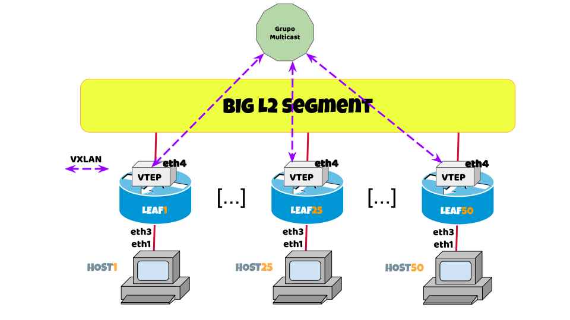

# Lab 1: VXLAN over Multicast

We will demonstrate how a VXLAN service can be configured where we assign the address of the remote VTEPs statically but with a destination address defined in a multicast group.

All LEAF devices are interconnected in the same VLAN on their eth4 interface.

A use case for this example is when we have multiple hypervisors connected to the same Layer 2 network segment (underlay), and we want a certain number of overlay networks to be created on this segment (something like virtual VLANs).

!!! warning "IMPORTANT"

    In all cases where a reference to the term `[X]` is found, the participant must replace it with their seat number.

     For example, for seat number 32:
    
     * The command `ip address 10.[X].10.0/24` translates to `ip address 10.32.10.0/24`.
     * The command `router bgp 42949672[X]` translates to `router bgp 4294967232`.
     * The `LEAF[X]` device should be interpreted as `LEAF32`.

??? error "Conect to Lab"

    <a href="https://ssh.nog.lat/?hostname=access.nog.lat&username=lablacnog&password=UmFkaWFQZXJsbWFuCg==" target="_blank">Click to open in a new tab 😉</a>

    In order to disconnect from any device and return to main menu: ++ctrl+d++



!!! note
    The IPv6 multicast group address that we use in this practice is: `FF05::101` and all LEAF[X] must belong to the same group address.

## Activity 1.0

??? example "Activity 1.0.1"
    Configure the eth1 port of HOST[X] so that it can send ethernet frames without VLANID to the rest of the devices.

    === "HOST[X]"

        ```txt hl_lines="3 11 13"
        / # ip link set dev eth1 up
        / # ip link show dev eth1
            4811: eth1@if4812: <BROADCAST,MULTICAST,UP,LOWER_UP> mtu 9500 qdisc noqueue state UP mode DEFAULT group default 
            link/ether aa:c1:ab:36:6a:30 brd ff:ff:ff:ff:ff:ff link-netnsid 1
        
        / # ip address add 10.0.0.[X]/24 dev eth1
        / # ip -6 address add 2001:db8:bebe:cafe::[X]/64 dev eth1
        / # ip address show dev eth1
        4811: eth1@if4812: <BROADCAST,MULTICAST,UP,LOWER_UP> mtu 9500 qdisc noqueue state UP group default 
            link/ether aa:c1:ab:36:6a:30 brd ff:ff:ff:ff:ff:ff link-netnsid 1
            inet 10.0.0.[X]/24 scope global eth1
            valid_lft forever preferred_lft forever
            inet6 2001:db8:bebe:cafe::[X]/64 scope global 
            valid_lft forever preferred_lft forever
            inet6 fe80::a8c1:abff:fe36:6a30/64 scope link 
            valid_lft forever preferred_lft forever
        ```

??? example "Activity 1.0.2"
    Configure the eth4 port of LEAF[X] to be able to communicate with the rest of the LEAFs in an L2 segment.

    === "LEAF[X]"

        ```txt hl_lines="3 10"
        / # ip link set dev eth4 up
        / # ip link show dev eth4
            4811: eth1@if4812: <BROADCAST,MULTICAST,UP,LOWER_UP> mtu 9500 qdisc noqueue state UP mode DEFAULT group default 
            link/ether aa:c1:ab:36:6a:30 brd ff:ff:ff:ff:ff:ff link-netnsid 1
        
        / # ip -6 address add 2001:db8:bd:e4::[X]/64 dev eth4
        / # ip address show dev eth4
        649: eth4@if648: <BROADCAST,MULTICAST,UP,LOWER_UP> mtu 9500 qdisc noqueue state UP group default 
            link/ether aa:c1:ab:ff:b8:93 brd ff:ff:ff:ff:ff:ff link-netnsid 0
            inet6 2001:db8:bd:e4::[X]/64 scope global 
                valid_lft forever preferred_lft forever
            inet6 fe80::a8c1:abff:feff:b893/64 scope link 
                valid_lft forever preferred_lft forever
        ```

## Activity 1.1

??? example "Activity 1.1.1"

    Create a bridge interface that will include ether3 as member (link to HOST[X]) and a VXLAN interface with VNI = 101.

    ### LEAF[X]

    ```txt hl_lines="5 10"
        / # ip link add name bridge101 type bridge
        / # ip link set bridge101 up
        / # ip link set eth3 master bridge101
        / # bridge link
        4812: eth3@if4811: <BROADCAST,MULTICAST,UP,LOWER_UP> mtu 9500 master bridge101 state forwarding priority 32 cost 2
    ```

??? example "Activity 1.1.2"

    On LEAF[X], generate a VXLAN interface using IPv6 as the transport protocol so that all `HOST[X]` think they are on the same VLAN.

     Remote MAC addresses will be learned by flooding which is statically configured to a multicast VTEP address.

    ### LEAF[X], generate VXLAN

    ```txt
        # Generate a VXLAN interface with VNI101 using the IPv6 of eth4 as VTEP
        / # ip link add vxlan101 mtu 9000 type vxlan id 101 dev eth4 ttl 3 local 2001:db8:bd:e4::[X] group FF05::101 dstport 4789
        
        # Activate VXLAN
        / # ip link set vxlan101 up
    ```

    ### LEAF[X], add VXLAN to bridge

    ```txt hl_lines="4 5 8 9"
        / # ip link set vxlan101 master bridge101
        
        / # bridge link
        4812: eth3@if4811: <BROADCAST,MULTICAST,UP,LOWER_UP> mtu 9500 master bridge101 state forwarding priority 32 cost 2 
        5: vxlan101: <BROADCAST,MULTICAST> mtu 9000 master bridge101 state disabled priority 32 cost 100 
        
        / # brctl show
        bridge name     bridge id               STP enabled     interfaces
        bridge101               8000.6e55c6b9b77a       no              eth3
                                                                    vxlan101
    ```

## Activity 1.2

??? example "Activity 1.2.1"

    Check connectivity between the different HOST[X] (that have already completed all configuration tasks).

    ### HOST[X] (IPv4)

    ```txt hl_lines="14 15 16"
    / # ping -c 10 -s 1500 -M dont 10.0.0.254
    PING 10.0.0.1 (10.0.0.254) 1500(1528) bytes of data.
    1508 bytes from 10.0.0.254: icmp_seq=1 ttl=64 time=0.104 ms
    1508 bytes from 10.0.0.254: icmp_seq=2 ttl=64 time=0.076 ms
    1508 bytes from 10.0.0.254: icmp_seq=3 ttl=64 time=0.081 ms
    1508 bytes from 10.0.0.254: icmp_seq=4 ttl=64 time=0.073 ms
    1508 bytes from 10.0.0.254: icmp_seq=5 ttl=64 time=0.077 ms
    1508 bytes from 10.0.0.254: icmp_seq=6 ttl=64 time=0.085 ms
    1508 bytes from 10.0.0.254: icmp_seq=7 ttl=64 time=0.077 ms
    1508 bytes from 10.0.0.254: icmp_seq=8 ttl=64 time=0.101 ms
    1508 bytes from 10.0.0.254: icmp_seq=9 ttl=64 time=0.084 ms
    1508 bytes from 10.0.0.254: icmp_seq=10 ttl=64 time=0.081 ms

    --- 10.0.0.254 ping statistics ---
    10 packets transmitted, 10 received, 0% packet loss, time 9217ms
    rtt min/avg/max/mdev = 0.073/0.083/0.104/0.010 ms
    ```

    ### HOST[X] (IPv6)

    ```txt hl_lines="14 15 16"
    / # ping6 -c 10 -s 1500 -M dont 2001:db8:bebe:cafe::254
    PING 2001:db8::1(2001:db8:bebe:cafe::254) 1500 data bytes
    1508 bytes from 2001:db8:bebe:cafe::254: icmp_seq=1 ttl=64 time=0.664 ms
    1508 bytes from 2001:db8:bebe:cafe::254: icmp_seq=2 ttl=64 time=0.029 ms
    1508 bytes from 2001:db8:bebe:cafe::254: icmp_seq=3 ttl=64 time=0.033 ms
    1508 bytes from 2001:db8:bebe:cafe::254: icmp_seq=4 ttl=64 time=0.048 ms
    1508 bytes from 2001:db8:bebe:cafe::254: icmp_seq=5 ttl=64 time=0.057 ms
    1508 bytes from 2001:db8:bebe:cafe::254: icmp_seq=6 ttl=64 time=0.018 ms
    1508 bytes from 2001:db8:bebe:cafe::254: icmp_seq=7 ttl=64 time=0.037 ms
    1508 bytes from 2001:db8:bebe:cafe::254: icmp_seq=8 ttl=64 time=0.034 ms
    1508 bytes from 2001:db8:bebe:cafe::254: icmp_seq=9 ttl=64 time=0.033 ms
    1508 bytes from 2001:db8:bebe:cafe::254: icmp_seq=10 ttl=64 time=0.054 ms

    --- 2001:db8:bebe:cafe::254 ping statistics ---
    10 packets transmitted, 10 received, 0% packet loss, time 9197ms
    rtt min/avg/max/mdev = 0.018/0.100/0.664/0.188 ms
    ```

## Activity 1.3

??? example "Activity 1.3.1"

    Clear LEAF[X] configurations before continuing to the next lab

    ### LEAF[X]

    ```txt 
    / # ip link del dev vxlan101
    / # ip link del dev bridge101
    ```

Continue to [LAB2](../lab2/)
