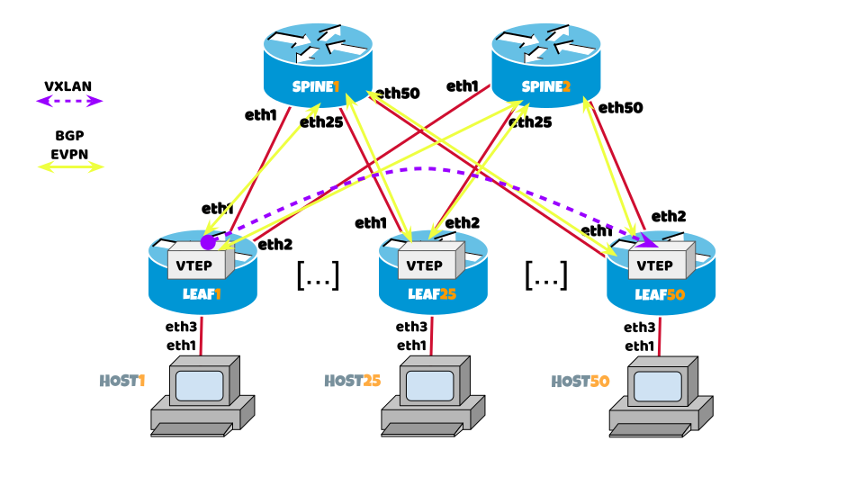

# Lab 2: VXLAN and BGP EVPN

In this practice, we are going to configure a VXLAN service where all the information of the VTEPs and equipment connected to the VNI is exchanged through a control plane based on the EVPN protocol, which allows different types of NLRI to be exchanged.

All the devices are interconnected on their eth1 interface towards SPINE1 and on their eth2 interface towards SPINE2.

SPINE1 and SPINE2 are configured to establish BGP peers on all their interfaces **from autonomous system 65007**.



To complete this exercise, a multi-family BGP session must be built from each LEAF to SPINE1 and SPINE2, when activating EVPN support, all the MACs of each HOST will be known by advertising this data together with the VNI for each session BGP.

There are two basic types of reachability information that a VTEP sends through BGP EVPN

* Information on how to handle BUM traffic from a given VNI (such as type 3 routes).
* For each VNI, the local MAC addresses (as type 2 routes).

??? error "Conect to Lab"

    <a href="https://ssh.nog.lat/?hostname=access.nog.lat&username=lablacnog&password=UmFkaWFQZXJsbWFuCg==" target="_blank">Click to open lab in a new tab 😉</a>

    To disconnect from any device and return to main menu: ++ctrl+d++

## Activity 2.1

??? example "Activity 2.1.1"

    In LEAF[X] we are going to generate a bridge101 interface that will include ether3 as a member (link to HOST[X]).

    === "LEAF[X]"

        ```txt hl_lines="6"
            / # ip link add name bridge101 type bridge
            / # ip link set eth3 up
            / # ip link set bridge101 up
            / # ip link set eth3 master bridge101
            / # bridge link
            4812: eth3@if4811: <BROADCAST,MULTICAST,UP,LOWER_UP> mtu 9500 master bridge101 state forwarding priority 32 cost 2
        ```

    Before generating the VXLAN interface, we must assign an IPv4 or IPv6 address to LEAF[X] so that it can be used as VTEP and advertised by BGP to the rest of the network. This VTEP must be reachable by all participants so that VXLAN tunnels can eventually be dynamically generated when EVPN distributes all reachability information among all routers.

    === "LEAF[X]"

        ```txt hl_lines="7"
            / # ip -6 address add 2001:db8:beef::[X]/128 dev lo
            / # ip a show dev lo
            1: lo: <LOOPBACK,UP,LOWER_UP> mtu 65536 qdisc noqueue state UNKNOWN group default qlen 1000
                link/loopback 00:00:00:00:00:00 brd 00:00:00:00:00:00
                inet 127.0.0.1/8 scope host lo
                valid_lft forever preferred_lft forever
                inet 100.100.100.[X]/32 scope global lo
                valid_lft forever preferred_lft forever
                inet6 ::1/128 scope host 
                valid_lft forever preferred_lft forever
        ```

??? example "Activity 2.1.2"

    Now in LEAF[X], we are going to generate a VXLAN interface with VNI = 101 indicating that the local VTEP address is the one recently created.
    Then we will create a bridge to connect the `vxlan101` with the eth3.

    === "LEAF[X]"

        ```txt hl_lines="4 10 16"
            / # ip link add vxlan101 mtu 9000 type vxlan id 101 local 2001:db8:beef::[X] dstport 4789 nolearning
            / # ip link set vxlan101 up

            / # vtysh -c "show interface vxlan101"
                Interface vxlan101 is up, line protocol is up
                Link ups:       1    last: 2022/09/13 23:04:22.73
                Link downs:     0    last: (never)
                vrf: default
                index 4 metric 0 mtu 9000 speed 0 
                flags: <UP,BROADCAST,RUNNING,MULTICAST>
                Type: Ethernet
                HWaddr: 26:8d:4d:86:5e:c1
                inet6 fe80::248d:4dff:fe86:5ec1/64
                Interface Type Vxlan
                Interface Slave Type None
                VxLAN Id 101 VTEP IP: 100.100.100.[X]
                protodown: off 
        ```

??? example "Activity 2.1.3"

    In LEAF[X], we add interface `vxlan101` to bridge `bridge101`.

    === "LEAF[X]"

        ```txt hl_lines="3 4"
            / # ip link set vxlan101 master bridge101
            / # bridge link
            282: eth3@if281: <BROADCAST,MULTICAST,UP,LOWER_UP> mtu 9500 master bridge101 state forwarding priority 32 cost 2 
            4: vxlan101: <BROADCAST,MULTICAST,UP,LOWER_UP> mtu 9000 master bridge101 state forwarding priority 32 cost 100 
        ```

??? example "Activity 2.1.4"

    In LEAF[X], we configure BGP sessions over interfaces eth1 and eth2 using RFC8950 in the FRRouting software.

    !!! info "Important"
        Enter the FRRouting configuration by running the `vtysh` command.

    === "LEAF[X] (en vtysh)"

        ```txt
            configure terminal
            
            router bgp [X]
             bgp router-id 100.100.100.[X]
             bgp log-neighbor-changes
             bgp default show-nexthop-hostname
             no bgp ebgp-requires-policy
             no bgp default ipv4-unicast
             bgp bestpath as-path multipath-relax
             timers bgp 3 9
             neighbor SPINE peer-group
             ! please do not modify the value 65007 of the next command...
             neighbor SPINE remote-as 65007
             !
             neighbor SPINE capability extended-nexthop
             neighbor eth1 interface peer-group SPINE
             neighbor eth1 description SPINE1
             neighbor eth2 interface peer-group SPINE
             neighbor eth2 description SPINE2
             !
             address-family ipv6 unicast
              maximum-paths 64
              neighbor SPINE activate
              redistribute connected
             exit-address-family
            !
             address-family l2vpn evpn
              neighbor SPINE activate
              advertise-all-vni
             exit-address-family
            end

            write
        ```

??? example "Activity 2.1.5"

    In LEAF[X], we check that the peers are correctly established against SPINE1 and SPINE2 in the 3 address-family (IPv4, IPv6, L2VPN EVPN).

    === "LEAF[X] (inside vtysh)"

        ```txt hl_lines="3 11 12 17 25 26 31 39 40"
        leaf[X]# show bgp sum established 

        IPv6 Unicast Summary (VRF default):
        BGP router identifier 100.100.100.[X], local AS number [X] vrf-id 0
        BGP table version 2
        RIB entries 3, using 576 bytes of memory
        Peers 2, using 1433 KiB of memory
        Peer groups 1, using 64 bytes of memory

        Neighbor        V         AS   MsgRcvd   MsgSent   TblVer  InQ OutQ  Up/Down State/PfxRcd   PfxSnt Desc
        eth1            4      65007       109       111        0    0    0 00:05:11            0        2 SPINE1
        eth2            4      65007       109       111        0    0    0 00:05:11            0        2 SPINE2

        Displayed neighbors 2
        Total number of neighbors 2

        L2VPN EVPN Summary (VRF default):
        BGP router identifier 100.100.100.[X], local AS number [X] vrf-id 0
        BGP table version 0
        RIB entries 1, using 192 bytes of memory
        Peers 2, using 1433 KiB of memory
        Peer groups 1, using 64 bytes of memory

        Neighbor        V         AS   MsgRcvd   MsgSent   TblVer  InQ OutQ  Up/Down State/PfxRcd   PfxSnt Desc
        eth1            4      65007       109       111        0    0    0 00:05:11            0        1 SPINE1
        eth2            4      65007       109       111        0    0    0 00:05:11            0        1 SPINE2

        Displayed neighbors 2
        Total number of neighbors 2
        ```

??? example "Activity 2.1.6"

    In LEAF[X], we check that NLRI information is received in IPv6 and L2VPN EVPN.

    === "LEAF[X] (en vtysh) - MAC received per VNI"

        ```txt hl_lines="2 5"
        leaf[X]# show evpn mac vni 101
        Number of MACs (local and remote) known for this VNI: 2
        Flags: N=sync-neighs, I=local-inactive, P=peer-active, X=peer-proxy
        MAC               Type   Flags Intf/Remote ES/VTEP            VLAN  Seq #'s
        aa:c1:ab:e6:99:af remote       100.100.100.[Y]                      0/0
        aa:c1:ab:93:63:02 local        eth3                                 0/0
        ```

    === "LEAF[X] (en vtysh) - NLRI received by BGP EVPN"

        ```txt hl_lines="21 24 34"
        leaf[X]# show bgp l2vpn evpn route
        BGP table version is 1, local router ID is 100.100.100.[X]
        Status codes: s suppressed, d damped, h history, * valid, > best, i - internal
        Origin codes: i - IGP, e - EGP, ? - incomplete
        EVPN type-1 prefix: [1]:[EthTag]:[ESI]:[IPlen]:[VTEP-IP]:[Frag-id]
        EVPN type-2 prefix: [2]:[EthTag]:[MAClen]:[MAC]:[IPlen]:[IP]
        EVPN type-3 prefix: [3]:[EthTag]:[IPlen]:[OrigIP]
        EVPN type-4 prefix: [4]:[ESI]:[IPlen]:[OrigIP]
        EVPN type-5 prefix: [5]:[EthTag]:[IPlen]:[IP]

        Network          Next Hop            Metric LocPrf Weight Path
                            Extended Community
        Route Distinguisher: 100.100.100.[Y]:2
        *  [3]:[0]:[32]:[100.100.100.[Y]]
                            100.100.100.[Y]                          0 65007 [Y] i
                            RT:[Y]:101 ET:8
        *> [3]:[0]:[32]:[100.100.100.[Y]]
                            100.100.100.[Y]                          0 65007 [Y] i
                            RT:[Y]:101 ET:8
        Route Distinguisher: 100.100.100.[Y]:2
        *  [2]:[0]:[48]:[aa:c1:ab:e6:99:af]
                            100.100.100.[Y]                          0 65007 [Y] i
                            RT:[Y]:101 ET:8
        *> [2]:[0]:[48]:[aa:c1:ab:e6:99:af]
                            100.100.100.[Y]                          0 65007 [Y] i
                            RT:[Y]:101 ET:8
        *  [3]:[0]:[32]:[100.100.100.[Y]]
                            100.100.100.[Y]                          0 65007 [Y] i
                            RT:[Y]:101 ET:8
        *> [3]:[0]:[32]:[100.100.100.[Y]]
                            100.100.100.[Y]                          0 65007 [Y] i
                            RT:[Y]:101 ET:8
        Route Distinguisher: 100.100.100.[X]:2
        *> [2]:[0]:[48]:[aa:c1:ab:93:63:02]
                            100.100.100.[X]                     32768 i
                            ET:8 RT:[X]:101
        *> [3]:[0]:[32]:[100.100.100.[X]]
                            100.100.100.[X]                     32768 i
                            ET:8 RT:[X]:101

        Displayed 5 prefixes (8 paths)
        ```

??? example "Activity 2.1.7"

    In HOST[X], we check L2 connectivity to the other hosts.

    === "HOST[X] - PING to another HOST"

        ```txt hl_lines="2 14-16"
        / # ping -c 10 -s 2000 -M dont 10.0.0.[Y]
        PING 10.0.0.[Y] (10.0.0.[Y]) 2000(2028) bytes of data.
        2008 bytes from 10.0.0.[Y]: icmp_seq=1 ttl=64 time=0.159 ms
        2008 bytes from 10.0.0.[Y]: icmp_seq=2 ttl=64 time=0.090 ms
        2008 bytes from 10.0.0.[Y]: icmp_seq=3 ttl=64 time=0.089 ms
        2008 bytes from 10.0.0.[Y]: icmp_seq=4 ttl=64 time=0.097 ms
        2008 bytes from 10.0.0.[Y]: icmp_seq=5 ttl=64 time=0.086 ms
        2008 bytes from 10.0.0.[Y]: icmp_seq=6 ttl=64 time=0.042 ms
        2008 bytes from 10.0.0.[Y]: icmp_seq=7 ttl=64 time=0.083 ms
        2008 bytes from 10.0.0.[Y]: icmp_seq=8 ttl=64 time=0.088 ms
        2008 bytes from 10.0.0.[Y]: icmp_seq=9 ttl=64 time=0.079 ms
        2008 bytes from 10.0.0.[Y]: icmp_seq=10 ttl=64 time=0.089 ms

        --- 10.0.0.[Y] ping statistics ---
        10 packets transmitted, 10 received, 0% packet loss, time 9202ms
        rtt min/avg/max/mdev = 0.042/0.090/0.159/0.027 ms
        ```

    === "HOST[X] - ARP Table"

        ```txt hl_lines="2"
        / # arp -an
        ? (10.0.0.[Y]) at aa:c1:ab:93:63:02 [ether] on eth1
        ```

    === "HOST[X] - NMAP"

        ```txt hl_lines="25"
        / # nmap -A 10.0.0.[Y]
        Starting Nmap 7.92 ( https://nmap.org ) at 2022-09-14 00:46 UTC
        Nmap scan report for 10.0.0.[Y]
        Host is up (0.000053s latency).
        Not shown: 998 closed tcp ports (reset)
        PORT    STATE SERVICE  VERSION
        80/tcp  open  http     nginx 1.20.2
        |_http-server-header: nginx/1.20.2
        |_http-title: Site doesn't have a title (text/html).
        443/tcp open  ssl/http nginx 1.20.2
        | ssl-cert: Subject: commonName=localhost
        | Not valid before: 2021-12-20T10:48:38
        |_Not valid after:  2031-12-18T10:48:38
        | tls-alpn: 
        |_  http/1.1
        |_ssl-date: TLS randomness does not represent time
        |_http-server-header: nginx/1.20.2
        | tls-nextprotoneg: 
        |_  http/1.1
        |_http-title: Site doesn't have a title (text/html).
        MAC Address: AA:C1:AB:93:63:02 (Unknown)
        
        [...]

        Network Distance: 1 hop

        TRACEROUTE
        HOP RTT     ADDRESS
        1   0.05 ms 10.0.0.[Y]

        OS and Service detection performed. Please report any incorrect results at https://nmap.org/submit/ .
        Nmap done: 1 IP address (1 host up) scanned in 35.46 seconds
        ```

    === "HOST[X] - TracePath with specific MTU"

        ```txt hl_lines="2 3"
        / # tracepath -4 -l 9000 -n 10.0.0.[Y]
        1:  10.0.0.[Y]                                             0.119ms reached
            Resume: pmtu 9000 hops 1 back 1 
        ```
