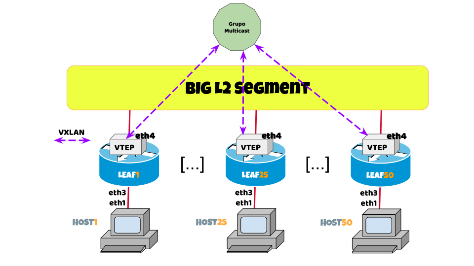

# Laboratorio 1: VXLAN con Multicast

Demostraremos cómo se puede configurar un servicio de VXLAN en donde asignamos la dirección de los VTEP remotos de manera estática pero con una dirección de destino definida en un grupo de multicast.

Todos los equipos LEAF están interconectados en una misma VLAN en su interface eth4.

Un caso de uso para este ejemplo es cuando tenemos múltiples hypervisores conectados a un mismo segmento de red de Capa 2 (underlay), y queremos que se cree una determinada cantidad de redes overlay sobre este segmento (algo así como VLANs virtuales).

!!! warning "IMPORTANTE"

    En todos los casos donde se encuentre una referencia al término `[X]` el participante deberá reemplazarlo por su número de asiento.

    Por ejemplo, para el asiento número 32:
    
    * El comando `ip address 10.[X].10.0/24` se traduce como `ip address 10.32.10.0/24`.
    * El comando `router bgp 42949672[X]` se traduce como `router bgp 4294967232`.
    * El equipo `LEAF[X]` debe ser interpretado como `LEAF32`.

??? error "Conectar al Laboratorio"

    <a href="https://ssh.nog.lat/?hostname=access.nog.lat&username=lablacnog&password=UmFkaWFQZXJsbWFuCg==" target="_blank">Click para abrir el laboratorio en una nueva pestaña 😉</a>

    Desconectar de un equipo y volver al menú principal: ++ctrl+d++



!!! note
    La dirección de grupo de multicast IPv6 que utilizaremos en esta práctica es: `FF05::101` y todos los LEAF[X] deben pertenecer a la misma dirección de grupo.

## Actividad 1.0

??? example "Actividad 1.0.1"
    Configurar el puerto eth1 de HOST[X] de manera tal que pueda enviar frames ethernet sin VLANID hacia el resto de los equipos.

    === "HOST[X]"

        ```txt hl_lines="3 11 13"
        / # ip link set dev eth1 up
        / # ip -color link show dev eth1
            4811: eth1@if4812: <BROADCAST,MULTICAST,UP,LOWER_UP> mtu 9500 qdisc noqueue state UP mode DEFAULT group default 
            link/ether aa:c1:ab:36:6a:30 brd ff:ff:ff:ff:ff:ff link-netnsid 1
        
        / # ip address add 10.0.0.[X]/24 dev eth1
        / # ip -6 address add 2001:db8:bebe:cafe::[X]/64 dev eth1
        / # ip -color address show dev eth1
        4811: eth1@if4812: <BROADCAST,MULTICAST,UP,LOWER_UP> mtu 9500 qdisc noqueue state UP group default 
            link/ether aa:c1:ab:36:6a:30 brd ff:ff:ff:ff:ff:ff link-netnsid 1
            inet 10.0.0.[X]/24 scope global eth1
            valid_lft forever preferred_lft forever
            inet6 2001:db8:bebe:cafe::[X]/64 scope global 
            valid_lft forever preferred_lft forever
            inet6 fe80::a8c1:abff:fe36:6a30/64 scope link 
            valid_lft forever preferred_lft forever
        ```

??? example "Actividad 1.0.2"
    Configurar el puerto eth4 de LEAF[X] para poder comunicarse con el resto de los LEAF en un segmento L2.

    === "LEAF[X]"

        ```txt hl_lines="3 10"
        / # ip link set dev eth4 up
        / # ip -color link show dev eth4
            4811: eth1@if4812: <BROADCAST,MULTICAST,UP,LOWER_UP> mtu 9500 qdisc noqueue state UP mode DEFAULT group default 
            link/ether aa:c1:ab:36:6a:30 brd ff:ff:ff:ff:ff:ff link-netnsid 1
        
        / # ip -6 address add 2001:db8:bd:e4::[X]/64 dev eth4
        / # ip address show dev eth4
        649: eth4@if648: <BROADCAST,MULTICAST,UP,LOWER_UP> mtu 9500 qdisc noqueue state UP group default 
            link/ether aa:c1:ab:ff:b8:93 brd ff:ff:ff:ff:ff:ff link-netnsid 0
            inet6 2001:db8:bd:e4::[X]/64 scope global 
                valid_lft forever preferred_lft forever
            inet6 fe80::a8c1:abff:feff:b893/64 scope link 
                valid_lft forever preferred_lft forever
        ```

## Actividad 1.1

??? example "Actividad 1.1.1"

    Vamos a generar una interface bridge que va a incluír como miembros a la ether3 (link hacia HOST[X]) y por otro lado a una inteface VXLAN con VNI = 101.

    ### LEAF[X]

    ```txt hl_lines="5 10"
        / # ip link add name bridge101 type bridge
        / # ip link set bridge101 up
        / # ip link set eth3 master bridge101
        / # bridge -color link
        4812: eth3@if4811: <BROADCAST,MULTICAST,UP,LOWER_UP> mtu 9500 master bridge101 state forwarding priority 32 cost 2
    ```

??? example "Actividad 1.1.2"

    En LEAF[X], generar una interface VXLAN utilizando IPv6 como protocolo de transporte de manera tal que todos los `HOST[X]` piensen que se encuentran en la misma VLAN.

    Las direcciones MAC remotas se aprenderán gracias al flooding que se configura de manera estática hacia una dirección VTEP de multicast.

    ### LEAF[X], generar VXLAN

    ```txt
        # Genero una VXLAN con VNI101 utilizando la IPv6 de eth4 como VTEP
        / # ip link add vxlan101 mtu 9000 type vxlan id 101 dev eth4 ttl 3 local 2001:db8:bd:e4::[X] group FF05::101 dstport 4789
        
        # Activo la VXLAN
        / # ip link set vxlan101 up
    ```

    ### LEAF[X], agregar VXLAN al bridge

    ```txt hl_lines="4 5 8 9"
        / # ip link set vxlan101 master bridge101
        
        / # bridge -color link
        4812: eth3@if4811: <BROADCAST,MULTICAST,UP,LOWER_UP> mtu 9500 master bridge101 state forwarding priority 32 cost 2 
        5: vxlan101: <BROADCAST,MULTICAST> mtu 9000 master bridge101 state disabled priority 32 cost 100 
        
        / # brctl show
        bridge name     bridge id               STP enabled     interfaces
        bridge101               8000.6e55c6b9b77a       no              eth3
                                                                    vxlan101
    ```

## Actividad 1.2

??? example "Actividad 1.2.1"

    Chequear conectividad entre los distintos HOST[X] (que ya hayan completado la actividad).

    ### HOST[X] (IPv4)

    ```txt hl_lines="14 15 16"
    / # ping -c 10 -s 1500 -M dont 10.0.0.254
    PING 10.0.0.1 (10.0.0.254) 1500(1528) bytes of data.
    1508 bytes from 10.0.0.254: icmp_seq=1 ttl=64 time=0.104 ms
    1508 bytes from 10.0.0.254: icmp_seq=2 ttl=64 time=0.076 ms
    1508 bytes from 10.0.0.254: icmp_seq=3 ttl=64 time=0.081 ms
    1508 bytes from 10.0.0.254: icmp_seq=4 ttl=64 time=0.073 ms
    1508 bytes from 10.0.0.254: icmp_seq=5 ttl=64 time=0.077 ms
    1508 bytes from 10.0.0.254: icmp_seq=6 ttl=64 time=0.085 ms
    1508 bytes from 10.0.0.254: icmp_seq=7 ttl=64 time=0.077 ms
    1508 bytes from 10.0.0.254: icmp_seq=8 ttl=64 time=0.101 ms
    1508 bytes from 10.0.0.254: icmp_seq=9 ttl=64 time=0.084 ms
    1508 bytes from 10.0.0.254: icmp_seq=10 ttl=64 time=0.081 ms

    --- 10.0.0.254 ping statistics ---
    10 packets transmitted, 10 received, 0% packet loss, time 9217ms
    rtt min/avg/max/mdev = 0.073/0.083/0.104/0.010 ms
    ```

    ### HOST[X] (IPv6)

    ```txt hl_lines="14 15 16"
    / # ping6 -c 10 -s 1500 -M dont 2001:db8:bebe:cafe::254
    PING 2001:db8::1(2001:db8:bebe:cafe::254) 1500 data bytes
    1508 bytes from 2001:db8:bebe:cafe::254: icmp_seq=1 ttl=64 time=0.664 ms
    1508 bytes from 2001:db8:bebe:cafe::254: icmp_seq=2 ttl=64 time=0.029 ms
    1508 bytes from 2001:db8:bebe:cafe::254: icmp_seq=3 ttl=64 time=0.033 ms
    1508 bytes from 2001:db8:bebe:cafe::254: icmp_seq=4 ttl=64 time=0.048 ms
    1508 bytes from 2001:db8:bebe:cafe::254: icmp_seq=5 ttl=64 time=0.057 ms
    1508 bytes from 2001:db8:bebe:cafe::254: icmp_seq=6 ttl=64 time=0.018 ms
    1508 bytes from 2001:db8:bebe:cafe::254: icmp_seq=7 ttl=64 time=0.037 ms
    1508 bytes from 2001:db8:bebe:cafe::254: icmp_seq=8 ttl=64 time=0.034 ms
    1508 bytes from 2001:db8:bebe:cafe::254: icmp_seq=9 ttl=64 time=0.033 ms
    1508 bytes from 2001:db8:bebe:cafe::254: icmp_seq=10 ttl=64 time=0.054 ms

    --- 2001:db8:bebe:cafe::254 ping statistics ---
    10 packets transmitted, 10 received, 0% packet loss, time 9197ms
    rtt min/avg/max/mdev = 0.018/0.100/0.664/0.188 ms
    ```

## Actividad 1.3

??? example "Actividad 1.3.1"

    Limpiar configuraciones del LEAF[X] antes de continuar con el siguiente laboratorio

    ### LEAF[X]

    ```txt 
    / # ip link del dev vxlan101
    / # ip link del dev bridge101
    ```

Ahora se puede continuar hacia el [LAB2](../lab2/)
