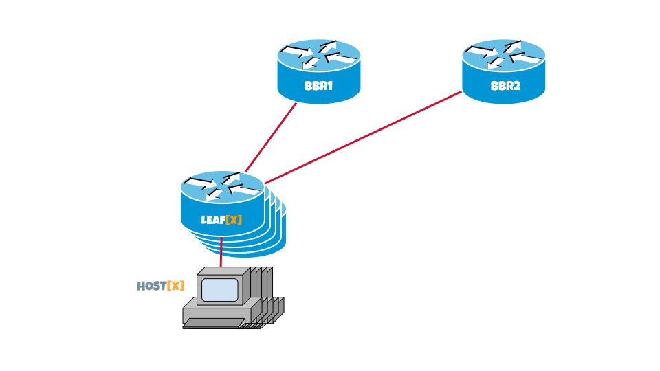

## Topologia da rede

!!! warning "IMPORTANTE"

    Em todos os casos onde se encontre uma referência ao `[X]` o participante deverá substitui-la por seu número de assento.

    Por exemplo, para o assento número 32:
    
    * O comando `ip address 10.[X].10.0/24` se converte para `ip address 10.32.10.0/24`.
    * O comando `router bgp 42949672[X]` se converte para `router bgp 4294967232`.
    * O equipamento `LEAF[X]` deve ser interpretado como `LEAF32`.

[Laboratorio 1](/es/lab1/)
[Laboratorio 2](/es/lab2/)
